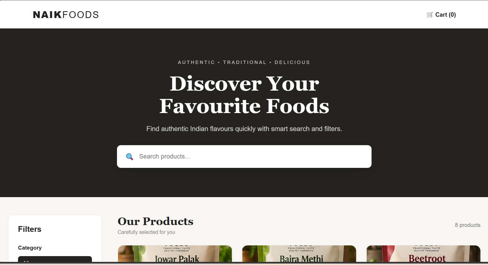
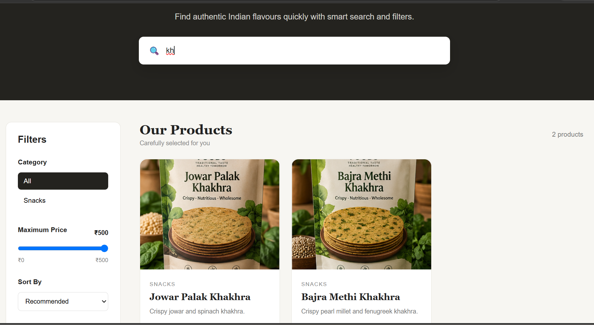
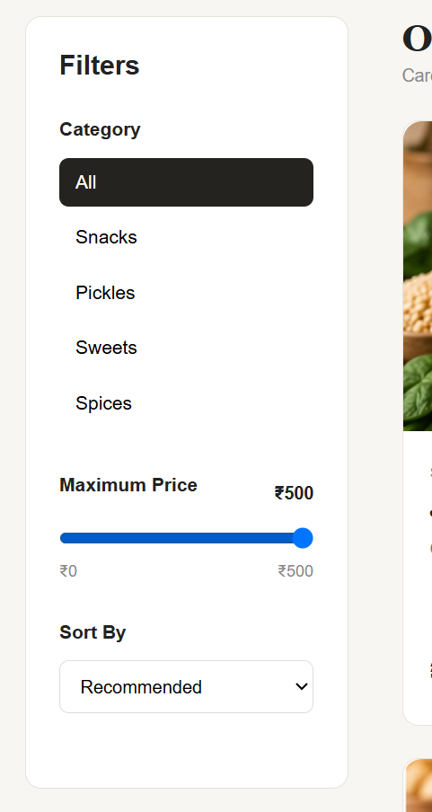
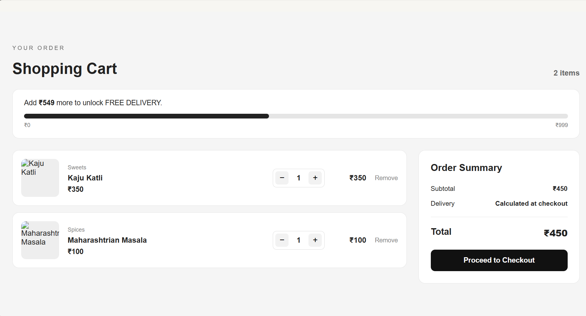

# Naik Foods – Smart Product Discovery

A MERN stack prototype developed as part of the Naik Foods Full Stack MERN Internship Assignment.

The project focuses on improving the product discovery experience of the Naik Foods e-commerce website by introducing search, category filtering, price filtering, sorting, responsive product cards, and a shopping cart with free-delivery progress tracking.

## Live Demo

**Frontend:** https://naik-foods-mern.vercel.app/

**Backend API:** https://naik-foods-api.onrender.com/

## GitHub Repository

The complete source code is available in this repository.

## Project Objective

The existing Naik Foods website provides a wide range of food products across multiple categories. The prototype focuses on making product discovery easier and improving the overall shopping experience.

The main goals were:

- Make products easier to discover
- Provide faster product search
- Allow users to filter products by category
- Allow users to filter products by price
- Provide product sorting
- Improve product presentation
- Provide a simple shopping cart experience
- Encourage customers to increase their cart value using a free-delivery progress indicator

## Key Features

### Smart Product Discovery

- Product search by name
- Category filtering
- Maximum price filtering
- Sorting by:
  - Recommended
  - Price: Low to High
  - Price: High to Low
  - Rating

### Product Cards

Each product displays:

- Product image
- Product name
- Category
- Description
- Rating
- Price
- Add to Cart button

### Shopping Cart

- Add products to cart
- Increase/decrease quantity
- Remove products
- Automatic subtotal calculation
- Cart item count
- Free-delivery progress indicator
- Order summary

### User Experience

- Responsive interface
- Loading state
- Error state
- Retry functionality
- Empty search-result state
- Product image hover effects
- Responsive cart layout

## Technology Stack

### Frontend

- React.js
- Vite
- JavaScript
- HTML5
- CSS3

### Backend

- Node.js
- Express.js
- REST API

### Database

- MongoDB
- MongoDB Atlas
- Mongoose

### Deployment

- Vercel – Frontend
- Render – Backend
- MongoDB Atlas – Database

## System Architecture

```text
                    User
                     |
                     v
              React + Vite
                (Vercel)
                     |
                     | REST API
                     v
              Node.js + Express
                 (Render)
                     |
                     v
                Mongoose
                     |
                     v
              MongoDB Atlas


## Screenshots

### Smart Product Discovery



### Product Search



### Filtering and Sorting



### Shopping Cart and  Free Delivery Progress

